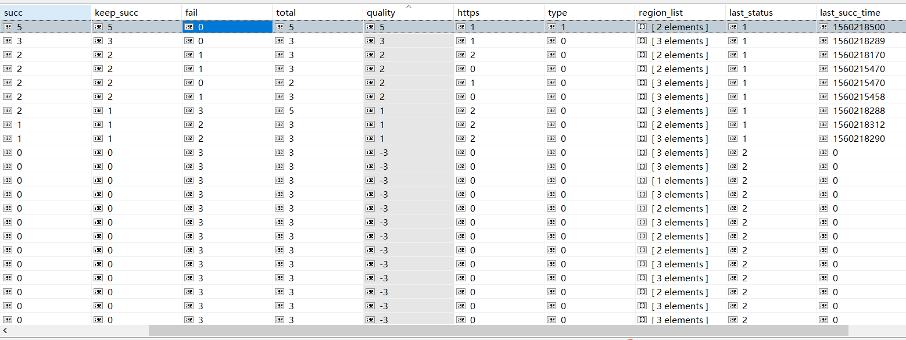
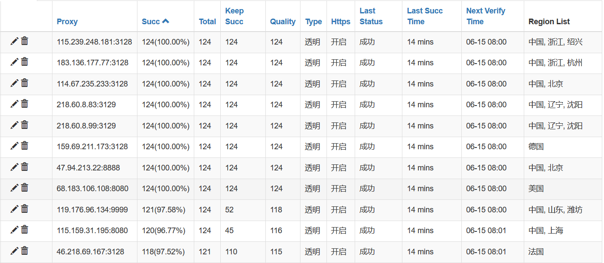
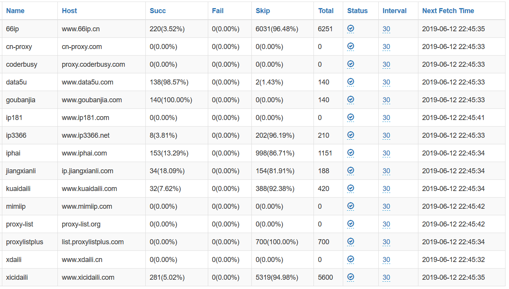

# 当前状况

不维护(新功能), 原因如下

1. 个人没有使用场景, 做出的东西可能不适用于现实场景.
2. 代码结构比较混乱, 因为是fork其他的项目, 代码的整体比较松散, 对代码洁癖来说, 是种折磨.
3. 使用场景不好, 无论是代理爬虫或者其他, 都不是一个有利于国家和社会的行为, 技术无罪, 人心难测.

以上, 不再开发新功能, 如果有bug之类的会进行修复, 仅供学习交流.

# 介绍

高质量, 高灵活的开放代理池服务

可能是`全球第一个`带有`智能动态代理`的代理池服务.

这下牛皮吹大了, 不好下来.

[ProxyPool Demo](http://proxy.1again.cc:35050/api/v1/proxy/) (我就是个栗子, 别指望我能有多稳定!)

---

# 功能/特点

我们的目标是`高质量`, `高灵活`.

所有功能都是围绕这两点开发的:

1. 所有代理都有验证的`计数`和`评分`, 验证成功的次数 / 总计验证的次数 == 代理可用率 (数据库界面)



2. 支持动态代理(手动加粗)

```
root@1again:~# curl -x "proxy.1again.cc:36050" https://httpbin.org/ip
{
  "origin": "183.82.32.56"
}
root@1again:~# curl -x "proxy.1again.cc:36050" https://httpbin.org/ip
{
  "origin": "200.149.19.170"
}
root@1again:~# curl -x "proxy.1again.cc:36050" https://httpbin.org/ip
{
  "origin": "125.21.43.82"
}
root@1again:~# curl -x "proxy.1again.cc:36050" https://httpbin.org/ip
{
  "origin": "110.52.235.124"
}
root@1again:~# curl -x "proxy.1again.cc:36050" https://httpbin.org/ip
{
  "origin": "176.74.134.6"
}
```

3. 获取代理时可以根据是否支持`https`, 透明还是匿名(普匿)`type`, 代理的所在的区域`region`进行过滤, 举栗子

```
# 获取支持https的proxy
http://proxy.1again.cc:35050/api/v1/proxy/?https=1

# 获取匿名的proxy
http://proxy.1again.cc:35050/api/v1/proxy/?type=2

# 获取所在区域为中国的proxy
http://proxy.1again.cc:35050/api/v1/proxy/?region=中国

# 获取所在区域不为中国的proxy
http://proxy.1again.cc:35050/api/v1/proxy/?region=!中国

# 获取支持https, 匿名, 所在区域为中国的rpoxy
http://proxy.1again.cc:35050/api/v1/proxy/?https=1&type=2&region=中国
```

4. [WEB页面的管理](http://proxy.1again.cc:35050/admin) 用户名:admin 密码:admin (尔敢乱动, 打洗雷啊!)



5. 可以通过WEB界面配置参数.


6. WEB管理`抓取代理的站点`



7. 支持`gevent`并发模式, 效果杠杠的, 别看广告, 看疗效!

```
2019-06-13 10:00:26,656 ProxyFetch.py[line:103] INFO fetch [   xicidaili   ] proxy finish,             total:400, succ:65, fail:0, skip:335, elapsed_time:1s
2019-06-13 10:00:26,662 ProxyFetch.py[line:103] INFO fetch [ proxylistplus ] proxy finish,             total:0, succ:0, fail:0, skip:0, elapsed_time:1s
2019-06-13 10:00:27,179 ProxyFetch.py[line:103] INFO fetch [     iphai     ] proxy finish,             total:83, succ:17, fail:0, skip:66, elapsed_time:2s
2019-06-13 10:00:27,374 ProxyFetch.py[line:103] INFO fetch [     66ip      ] proxy finish,             total:0, succ:0, fail:0, skip:0, elapsed_time:2s
2019-06-13 10:00:32,276 ProxyFetch.py[line:103] INFO fetch [    ip3366     ] proxy finish,             total:15, succ:0, fail:0, skip:15, elapsed_time:7s
2019-06-13 10:00:33,888 ProxyFetch.py[line:103] INFO fetch [     ip181     ] proxy finish,             total:0, succ:0, fail:0, skip:0, elapsed_time:8s
2019-06-13 10:00:34,978 ProxyFetch.py[line:103] INFO fetch [    mimiip     ] proxy finish,             total:0, succ:0, fail:0, skip:0, elapsed_time:9s
2019-06-13 10:00:38,182 ProxyFetch.py[line:103] INFO fetch [  proxy-list   ] proxy finish,             total:28, succ:28, fail:0, skip:0, elapsed_time:13s
2019-06-13 10:01:36,432 ProxyVerify.py[line:301] INFO useful_proxy verify proxy finish, total:636, succ:327, fail:309, elapsed_time:58s
2019-06-13 10:31:15,800 ProxyVerify.py[line:301] INFO useful_proxy verify proxy finish, total:481, succ:299, fail:182, elapsed_time:37s
2019-06-13 11:01:37,569 ProxyVerify.py[line:301] INFO useful_proxy verify proxy finish, total:639, succ:315, fail:324, elapsed_time:59s
2019-06-13 11:31:54,798 ProxyVerify.py[line:301] INFO useful_proxy verify proxy finish, total:977, succ:342, fail:635, elapsed_time:76s
2019-06-13 12:01:21,659 ProxyVerify.py[line:301] INFO useful_proxy verify proxy finish, total:608, succ:314, fail:294, elapsed_time:43s
```

8. 实在编不下去了, 你行你来!

# 文档

[设计文档](Docs/Design.md)

# 目前

基本上满足了当初的设想, 准备开始写文档和代码优化.

# 使用场景

1. 主要还是用于爬虫.

2. 公司需要有个内部代理池服务, 用来干一些丧尽天良的坏事.

3. 个人需要用来干一些见不得人的事.

# 安装/部署

## 生产环境

```shell
# Install Docker
curl -sSL https://get.docker.com | sh

# start mongo database
docker run -d --name mongo -v /data/mongodb:/data -p 27017:27017 mongo

# Start proxy_pool container
docker run -d --name proxy_pool --link mongo:proxy_pool_db -p 35050:35050 -p 36050:36050 1again/proxy_pool
```

## 开发环境

```shell
# Clone Repo
git clone https://github.com/1again/ProxyPool

# Entry Dir
cd ProxyPool

# Install Docker
curl -sSL https://get.docker.com | sh

# start mongo database
docker run -d --name mongo -v /data/mongodb:/data -p 27017:27017 mongo

# Start proxy_pool container
docker run -it --rm --link mongo:proxy_pool_db -v $(pwd):/usr/src/app -p 35050:35050 -p 36050:36050 1again/proxy_pool
```

# 使用

启动过几分钟后就能看到抓取到的代理IP, 你可以直接在WEB管理界面中中查看

## DYNAMIC PROXY

```shell
curl -x 'your_server_ip:36050' your_access_url

like this:
curl -x "proxy.1again.cc:36050" https://httpbin.org/ip
```

## RESTFUL API

```python

API_LIST = {
    "/api/v1/proxy/": {
        "args": {
            "https": {
                "value": [1],
                "desc": "need https proxy? 1 == true",
                "required": False,
            },
            "region": {
                "value": "region name like 中国 or 广州 or 江苏",
                "desc": "Get Region Proxy",
                "required": False,
            },
            "type": {
                "value": [1,2],
                "desc": "clear proxy 1 or (common) anonymous 2",
                "required": False,
            }
        },
        "desc": "Get A Random Proxy"
    },
    "/api/v1/proxies/": {
        "args": {
            "https": {
                "value": [1],
                "desc": "need https proxy? 1 == true",
                "required": False,
            },
            "region": {
                "value": "region name like 中国 or 广州 or 江苏",
                "desc": "Get Region Proxy",
                "required": False,
            },
            "type": {
                "value": [1,2],
                "desc": "clear proxy 1 or (common) anonymous 2",
                "required": False,
            }
        },
        "desc": "Get All Proxy",
    },
}

```

## 扩展代理

项目默认包含几个免费的代理获取方法

如果遇到好的免费代理渠道, 可以自行添加其他代理获取的方法.

添加一个新的代理获取方法如下:

首先在`Src/Fetcher/fetchers/`目录中添加你的代理类.

该类需要有一个`run`方法, 以生成器(yield)形式返回`host:ip`格式的代理，例如:

```python

# 文件名任意, 一般建议与`fetcher_host`的中间部分保持一致方便识别
# Class名, 固定为`CustomFetcher`
class CustomFetcher():
    # 只用来识别的, 会映射到数据库里面
    fetcher_host = "www.66ip.cn"

    def run(self):
        url_list = [
            'http://www.xxx.com/',
        ]
        for url in url_list:
            html_tree = getHtmlTree(url)
            ul_list = html_tree.xpath('//ul[@class="l2"]')
            for ul in ul_list:
                try:
                    yield ':'.join(ul.xpath('.//li/text()')[0:2])
                except Exception as e:
                    print(e)
```

`ProxyFetchSchedule` 会每隔一段时间抓取一次代理，下次抓取时会自动识别调用你定义的方法。

# Contributing

感谢你的支持, 让我们变得更好!

为了规范和清晰, 我们需要一起做些简单约定.

两个主要的分支
develop  为下个版本的内容
master   为当前稳定版本的内容

1. 小修小改, 不影响原版本的修改, 可以在develop上进行, 然后pull requests
2. 大动干戈, 影响之前版本的修改, 需要新建一个分支eg: feature_random_proxy, 然后进行pull requests.

我会将新分支合并到develop上, 并在演示的机器上运行一段时间后合并至master.

以上, 感谢!

# 问题反馈

任何问题欢迎在[Issues](https://github.com/1again/ProxyPool/issues)中反馈.

我们的目标是, 没有蛀牙!
